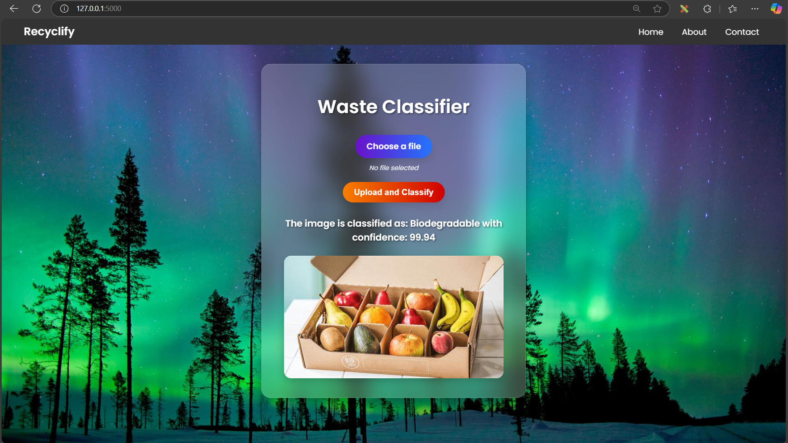
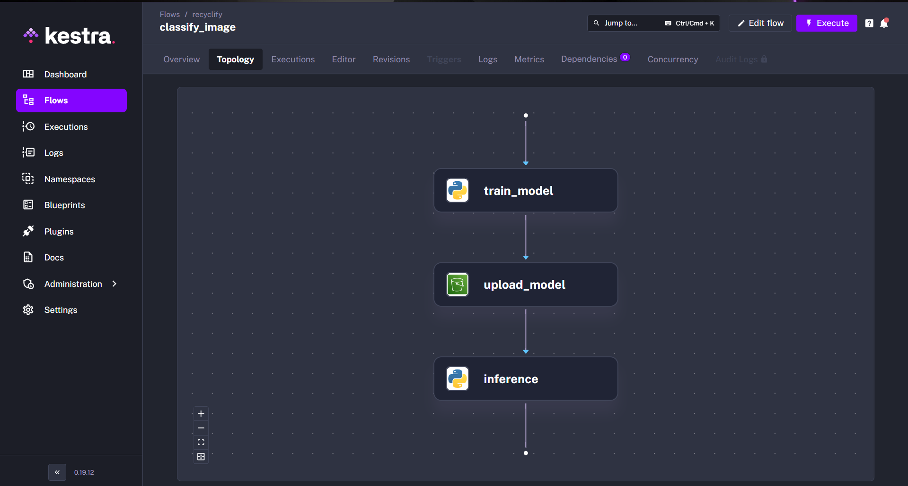

# Recyclify

Recyclify is an intelligent waste prediction platform that leverages image classification to identify and categorize waste as biodegradable or non-biodegradable. Using machine learning models, the platform analyzes user-uploaded images of waste items to predict their type and provide insights on how to properly dispose of or recycle them.



## Features

- Image Classification: Upload images of waste items to automatically classify them as biodegradable or non-biodegradable using a pre-trained image classification model.
- Waste Categorization: Automatically categorize waste into biodegradable (e.g., food scraps, organic matter) and non-biodegradable (e.g., plastics, metals, glass) categories.

## Installation

### Prerequisites

- Python
- TensorFlow
- Flask
- Kestra
- HTML
- CSS
- JavaScript
- Docker

### Procedure

#### 1. Clone the Repository

```bash
git clone https://github.com/PritBlitz/Recyclify.git

cd Recyclify
```

#### 2. Install Python Library

##### Tensorflow

Used for training and running the pre-trained image classification model to classify waste as biodegradable or non-biodegradable.

```bash
pip install tensorflow
```

##### Flask

Flask is used for creating the backend API that handles image uploads, processing requests, and serving the model's predictions.

```bash
pip install flask
```

### Training Model

Note : Due to Large size of the model the model could not be pushed so before running it train on your computer .
These are the following steps :

- Run train.py

```
python train.py
```

You would get a : waste_classifier.h5 file .

This file is the model that we will use for prediction.

- To test it run test.py

```
python test.py
```

- Now start the server by running app.py

```
python app.py
```

- The server would start running in

```
http://127.0.0.1:5000
```

- The Uploaded Image can be viewed for verification in the backend : static/upload

### Running Kestra

```
docker login
```

```
docker pull kestra/kestra
```

```
docker run -d -p 8080:8080 kestra/kestra
```

This would make the Kestra UI to open at

```
https://localhost/8080
```



## Licence

This project is licensed under the MIT License. See the LICENSE file for more details
